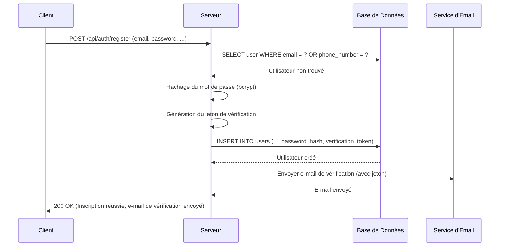
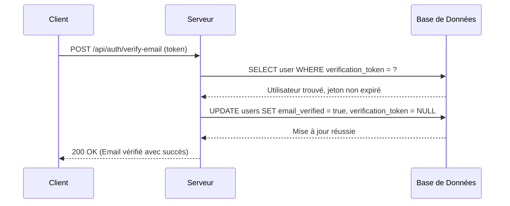
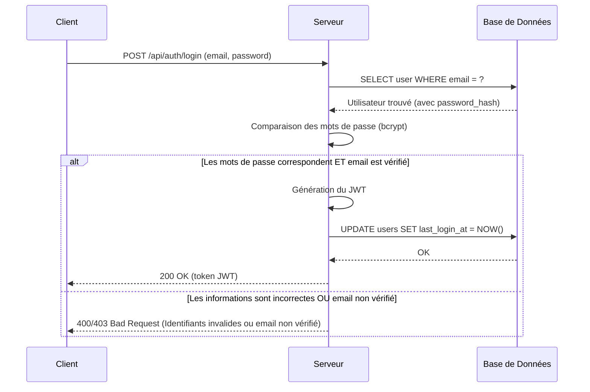
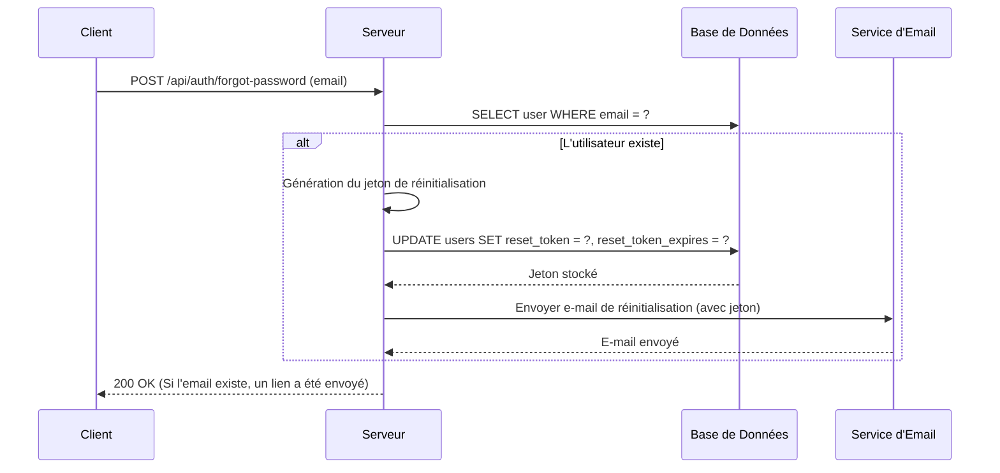
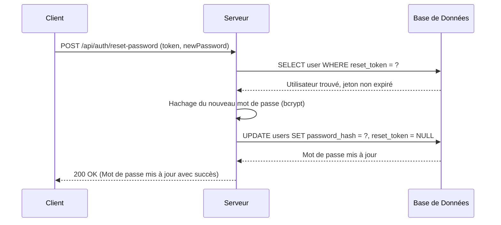

# Documentation du Système d'Authentification E-Society

## 1. Introduction

Ce document fournit une description technique détaillée du système d'authentification du backend de l'application **E-Society**. L'objectif est de clarifier les processus d'inscription, de connexion, de vérification d'e-mail et de réinitialisation de mot de passe.

Le système est construit en **Node.js** avec le framework **Express.js** et s'appuie sur une base de données **PostgreSQL** pour la persistance des données.

### Technologies Clés

-   **Express.js**: Framework web pour la gestion des routes et du serveur.
-   **PostgreSQL (`pg`)**: Base de données relationnelle pour le stockage des informations utilisateur.
-   **JSON Web Tokens (JWT)**: Pour la gestion des sessions authentifiées.
-   **bcrypt**: Pour le hachage sécurisé des mots de passe.
-   **Nodemailer**: Pour l'envoi des e-mails transactionnels (vérification, réinitialisation).

## 2. Flux d'Authentification et Diagrammes de Séquence

Cette section détaille chaque étape du cycle de vie de l'authentification, accompagnée de diagrammes de séquence au format Mermaid pour une meilleure visualisation.

### Inscription d'un Nouvel Utilisateur


### Vérification de l'E-mail


### Connexion de l'Utilisateur


### Réinitialisation du Mot de Passe

#### Étape 1: Demande de Réinitialisation


#### Étape 2: Soumission du Nouveau Mot de Passe


## 3. Composants Techniques Fondamentaux

Cette section plonge dans les détails de trois des piliers de notre système d'authentification : le service d'envoi d'e-mails, la génération de jetons sécurisés, et le mécanisme de hachage de mots de passe.

### 3.1. Envoi d'E-mails Transactionnels avec Nodemailer

Pour communiquer avec les utilisateurs lors d'événements cruciaux comme la vérification d'e-mail ou la réinitialisation de mot de passe, le système s'appuie sur le module **Nodemailer**.

#### Configuration du Transporteur SMTP

La configuration se trouve dans le fichier `src/mailer.js`. Un "transporteur" Nodemailer est créé et configuré pour se connecter à un serveur SMTP (Simple Mail Transfer Protocol). Toutes les informations de configuration sont externalisées dans le fichier `.env` pour des raisons de sécurité et de flexibilité.

```javascript
// src/mailer.js
const transporter = nodemailer.createTransport({
    host: process.env.SMTP_HOST,
    port: Number(process.env.SMTP_PORT),
    secure: false, // true pour le port 465, false pour les autres
    auth: {
        user: process.env.SMTP_USER,
        pass: process.env.SMTP_PASS
    }
});
```

-   **`host`**: L'adresse du serveur SMTP (ex: `smtp.gmail.com`).
-   **`port`**: Le port du serveur SMTP (`587` est commun pour une connexion sécurisée avec STARTTLS).
-   **`secure`**: Si `true`, la connexion utilisera SSL/TLS. `secure: false` avec le port `587` initie une connexion non cryptée qui est ensuite mise à niveau vers TLS.
-   **`auth`**: Un objet contenant les informations d'identification pour se connecter au serveur SMTP.

#### Fonction d'Envoi `sendMail`

Une fonction `sendMail` est exportée pour abstraire la logique d'envoi. Elle prend un objet contenant le destinataire (`to`), le sujet (`subject`) et le corps de l'e-mail (`html`), et utilise le transporteur configuré pour envoyer l'e-mail.

Cette abstraction permet d'appeler `sendMail` depuis n'importe où dans l'application (notamment depuis `src/routes/auth.js`) sans avoir à se soucier des détails de configuration de Nodemailer.

### 3.2. Génération de Jetons Aléatoires et Sécurisés

Les jetons utilisés pour la vérification des e-mails et la réinitialisation des mots de passe doivent être uniques et cryptographiquement sécurisés pour empêcher quiconque de les deviner. C'est le rôle du module `src/utils/tokens.js`.

```javascript
// src/utils/tokens.js
const crypto = require('crypto');

function generateRandomToken(size = 32) {
    return crypto.randomBytes(size).toString('hex');
}
```

-   **`crypto`**: Il s'agit du module cryptographique natif de Node.js, qui fournit des outils pour les opérations de sécurité.
-   **`crypto.randomBytes(size)`**: Cette fonction génère `size` octets de données pseudo-aléatoires cryptographiquement fortes. L'utilisation d'une source de hasard de qualité cryptographique est essentielle pour la sécurité. Le `size` de 32 octets par défaut fournit une entropie suffisante pour rendre la prédiction du jeton infaisable en pratique.
-   **`.toString('hex')`**: La sortie de `randomBytes` est un `Buffer` (une séquence d'octets). La méthode `.toString('hex')` convertit ces octets en une chaîne de caractères hexadécimaux, ce qui la rend facile à utiliser et à transmettre dans des URL ou des corps de requête JSON. Un buffer de 32 octets produira une chaîne hexadécimale de 64 caractères.

### 3.3. Hachage et Vérification des Mots de Passe avec `bcrypt`

La sécurité des mots de passe est la pierre angulaire de tout système d'authentification. Ce projet utilise la bibliothèque `bcrypt`, la norme de l'industrie pour le hachage de mots de passe. `bcrypt` est conçu pour être lent, ce qui le rend résistant aux attaques par force brute.

#### Hachage lors de l'Inscription (`bcrypt.hash`)

Lorsqu'un utilisateur s'inscrit, son mot de passe n'est jamais stocké en clair. Il est traité par la fonction `bcrypt.hash`.

```javascript
// Dans la route /register de src/routes/auth.js
const hashedPassword = await bcrypt.hash(
    password,
    Number(process.env.BCRYPT_SALT_ROUNDS) || 10
);
```

-   **Processus**: `bcrypt.hash` prend le mot de passe en clair et le combine avec une chaîne aléatoire unique appelée "sel" (salt). Ensuite, il exécute un algorithme de hachage sur cette combinaison un grand nombre de fois. Le sel est ensuite stocké dans la chaîne de hachage finale.
-   **`BCRYPT_SALT_ROUNDS`**: Cette variable d'environnement définit le "coût" de l'algorithme. Il s'agit du logarithme en base 2 du nombre d'itérations. Une valeur de `10` signifie 2^10 = 1024 itérations. Augmenter ce nombre d'un point double le temps de calcul. Cela permet d'ajuster la "lenteur" du hachage pour suivre l'augmentation de la puissance de calcul au fil du temps.

#### Comparaison lors de la Connexion (`bcrypt.compare`)

Lorsqu'un utilisateur tente de se connecter, la fonction `bcrypt.compare` est utilisée.

```javascript
// Dans la route /login de src/routes/auth.js
const match = await bcrypt.compare(password, user.password_hash);
```

-   **Processus**: `bcrypt.compare` prend le mot de passe en clair fourni par l'utilisateur et le hachage stocké dans la base de données. Il extrait le sel du hachage stocké, l'applique au mot de passe en clair, et exécute le même algorithme de hachage. Il compare ensuite le résultat avec le hachage stocké.
-   **Sécurité**: Cette approche est hautement sécurisée car elle permet de vérifier un mot de passe **sans jamais avoir à déchiffrer le hachage**. Le mot de passe en clair n'est utilisé que le temps de la comparaison et n'est jamais stocké.

## 4. Résumé des Points d'Extrémité de l'API

| Méthode | Route                            | Description                                                                 |
| :------ | :------------------------------- | :-------------------------------------------------------------------------- |
| `POST`  | `/api/auth/register`             | Crée un nouvel utilisateur.                                                 |
| `POST`  | `/api/auth/login`                | Connecte un utilisateur et retourne un JWT.                                 |
| `POST`  | `/api/auth/verify-email`         | Vérifie l'adresse e-mail d'un utilisateur à l'aide d'un jeton.              |
| `POST`  | `/api/auth/resend-verification`  | Renvoie un nouveau lien de vérification d'e-mail.                           |
| `POST`  | `/api/auth/forgot-password`      | Déclenche le processus de réinitialisation du mot de passe.                 |
| `POST`  | `/api/auth/reset-password`       | Met à jour le mot de passe de l'utilisateur à l'aide d'un jeton de réinitialisation. |
